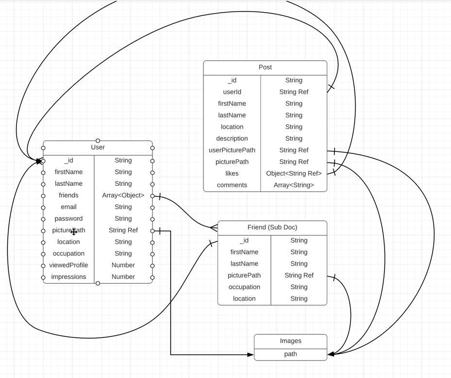

Application developed in React, Express and Mongo

> :fire: Development

```
  docker compose up -d && docker inspect mongo | grep IPAddress
  cd web && yarn && yarn dev
  cd server && yarn && yarn dev
```

> :gear: Environment Variables

- Server URL: VITE_APP_SERVER_URL `web`
- Server secret: SERVER_SECRET `server`
- Server port: SERVER_PORT `server`
- Database URL: MONGO_URL `server`

> :thought_balloon: `Ed roh`


> :dart: Documentation

<details>
<summary>:scroll: Roles</summary>

#### Coleções

- **Entidades:**
  - *Relacionamentos (Coleções):*
      User [1..n]
          Post
            Image [1..1]
          Friend
          Image [1..1]

  - *Propriedades:*
    - **User:**
      firstName
      lastName
      friends
      email
      password
      picturePath
      location
      viewedProfile
      impressions

    - **Post:**
      userId
      firtName
      lastName
      location
      description
      userPicturePath
      picturePath
      likes
      comments

    - **Friends:**
      firstName
      lastName
      picturePath
      occupation
      location

    - **Images:**
      path



</details>
