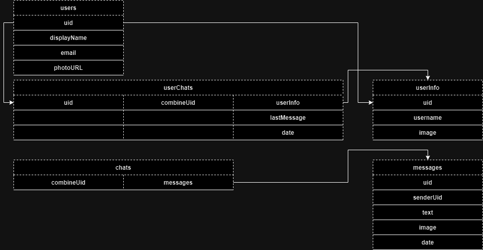

# :desktop_computer: Realtime Chat Application

## :briefcase: Stacks

- React (Vite/JavaScript)
- NoSQL (Firebase)

## :hammer: Tools

- Git
- NodeJs
- Yarn
- VS Code

## :fire: Run

- Development (Port 5173): `yarn dev`
- Build: `yarn build`

## :triangular_flag_on_post: Environment Variables

- Firebase API Key: `VITE_FIREBASE_APIKEY`
- Firebase Auth Domain: `VITE_FIREBASE_AUTHDOMAIN`
- Firebase Project ID: `VITE_FIREBASE_PROJECTID`
- Firebase Storage Bucket: `VITE_FIREBASE_STORAGEBUCKET`
- Firebase Messaging Sender ID: `VITE_FIREBASE_MESSAGINGSENDERID`
- Firebase APP ID: `VITE_FIREBASE_APPID`

## :page_facing_up: Docs

### Collections:

- users { uid, displayName, email, photoURL }
- chats { combineUid: { messages[{ uid, senderUid, text, image, date }] } }
- userChats { uid: { combineId: { userInfo: { uid, username, image }, lastMessage, date } } }

