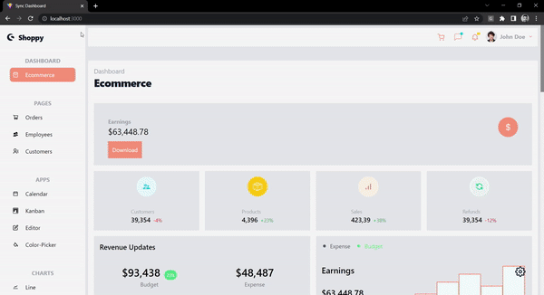

Application developed in Next, Express and Mongo

> :fire: Development

```
  docker compose up -d && docker inspect mongo | grep IPAddress
  cd web && yarn && yarn dev
  cd server && yarn && yarn dev
```

> :gear: Environment Variables

- Client URL: CLIENT_URL `server`
- Server Port: SERVER_PORT `server`
- Mongo URL: MONGODB_URI `server`
- JWT secret: JWT_SECRET `server`
- Stripe private key: PAYMENT_STRIPE_PRIVATE_KEY `server`
- Client Url: VITE_CLIENT_URL `web`
- Server Url: VITE_SERVER_URL `web`
- Cloudinary name: VITE_CLOUDINARY_CLOUD_NAME `web`
- Cloudinary Id: VITE_CLOUDINARY_CLOUD_ID `web`
- Cloudinary preset: VITE_CLOUDINARY_CLOUD_PRESET `web`
- Stripe public Key: VITE_PAYMENT_STRIPE_PUBLIC_KEY `web`

> :thought_balloon: `Lama Dev`


