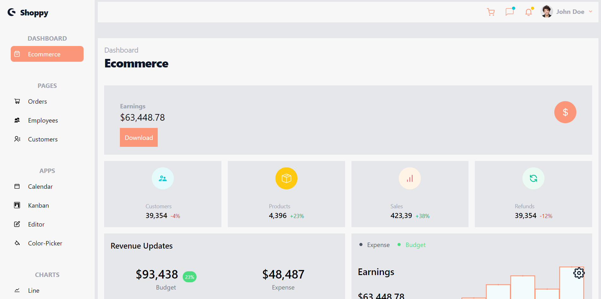

Application developed in React, Express and Mongo

> :fire: Development

```
  docker compose up -d && docker inspect mongo | grep IPAddress
  cd app && yarn
  cd app/web && yarn
  cd app && yarn dev
```

> :gear: Environment Variables

- Server port: SERVER_PORT `app`
- JWT secret: JWT_SECRET `app`
- Mongo URL: MONGO_URL `app`
- Braintree merchant ID : PAYMENT_MERCHANT_ID `app`
- Braintree public key: PAYMENT_PUBLIC_KEY `app`
- Braintree private key: PAYMENT_PRIVATE_KEY `app`
- Server URL: VITE_SERVER_URL `web`

> :thought_balloon: `Tech Info`


